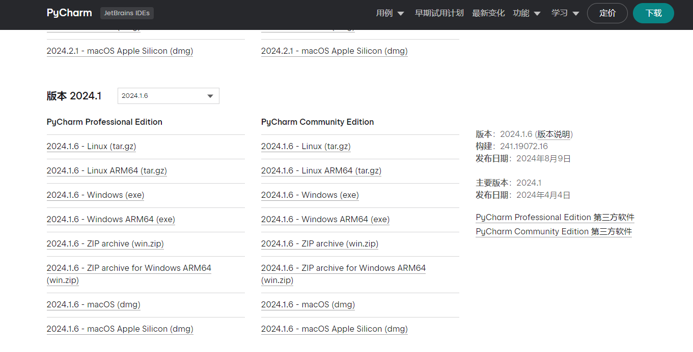
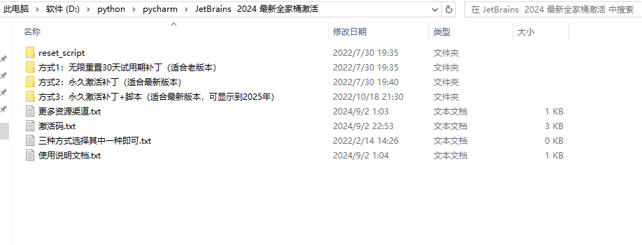

## PyCharm 2024.1 最新激活码,破解版安装教程（亲测好用~）

### 第一步：下载 Pycharm 安装包
#### 访问 Pycharm 官网，下载 Pycharm 2024.1 版本的安装包，下载链接如下 :
1. 官方下载链接(官方下载太慢了)：https://www.jetbrains.com/zh-cn/pycharm/download/other.html

打开页面后选择2024.1.6版本及以下进行下载.

2. 夸克网盘(我放在网盘里了用的是windows系统)：[链接点击我](https://pan.quark.cn/s/a3973bd57f9b)

### 第二步：安装 Pycharm 2024.1.6 版本
安装简单，我就不说了。。。。

### 第三步：破解补丁下载
破解补丁我放置在了网盘中
[网盘链接](https://pan.quark.cn/s/89113c9df362)

补丁下载成功后，记得先解压, 解压后的目录如下, 本文后面所需补丁都在下面标注的这个文件夹中：

点击【方式3】文件夹 , 进入到文件夹 /jetbra，目录如下：

### 第四步：开始破解
##### Windows 系统
将上面图示的补丁的所属文件夹 /jetbra 复制电脑某个位置
> 注意： 补丁所属文件夹需单独存放，且放置的路径不要有中文与空格，以免 Pycharm 读取补丁错误。

点击进入 /jetbra 补丁目录，再点击进入 /scripts 文件夹，双击执行 install-current-user.vbs 破解脚本：

> 注意：如果执行脚本被安全软件提示有风险拦截，允许执行即可。

会提示安装补丁需要等待数秒。点击【确定】按钮后，过程大概 10 - 30 秒，如看到弹框提示 Done 时，表示激活破解成功：

### 第五步：重启 Pycharm
> 脚本执行成功后，一定要重启 Pycharm ~~

### 第六步：填入指定激活码完成激活
重新打开 Pycharm 后，复制下面的激活码：
> EUWT4EE9X2-eyJsaWNlbnNlSWQiOiJFVVdUNEVFOVgyIiwibGljZW5zZWVOYW1lIjoic2lnbnVwIHNjb290ZXIiLCJhc3NpZ25lZU5hbWUiOiIiLCJhc3NpZ25lZUVtYWlsIjoiIiwibGljZW5zZVJlc3RyaWN0aW9uIjoiIiwiY2hlY2tDb25jdXJyZW50VXNlIjpmYWxzZSwicHJvZHVjdHMiOlt7ImNvZGUiOiJQU0kiLCJmYWxsYmFja0RhdGUiOiIyMDI1LTA4LTAxIiwicGFpZFVwVG8iOiIyMDI1LTA4LTAxIiwiZXh0ZW5kZWQiOnRydWV9LHsiY29kZSI6IlBDIiwiZmFsbGJhY2tEYXRlIjoiMjAyNS0wOC0wMSIsInBhaWRVcFRvIjoiMjAyNS0wOC0wMSIsImV4dGVuZGVkIjpmYWxzZX0seyJjb2RlIjoiUFBDIiwiZmFsbGJhY2tEYXRlIjoiMjAyNS0wOC0wMSIsInBhaWRVcFRvIjoiMjAyNS0wOC0wMSIsImV4dGVuZGVkIjp0cnVlfSx7ImNvZGUiOiJQV1MiLCJmYWxsYmFja0RhdGUiOiIyMDI1LTA4LTAxIiwicGFpZFVwVG8iOiIyMDI1LTA4LTAxIiwiZXh0ZW5kZWQiOnRydWV9LHsiY29kZSI6IlBDV01QIiwiZmFsbGJhY2tEYXRlIjoiMjAyNS0wOC0wMSIsInBhaWRVcFRvIjoiMjAyNS0wOC0wMSIsImV4dGVuZGVkIjp0cnVlfV0sIm1ldGFkYXRhIjoiMDEyMDIyMDkwMlBTQU4wMDAwMDUiLCJoYXNoIjoiVFJJQUw6MzUzOTQ0NTE3IiwiZ3JhY2VQZXJpb2REYXlzIjo3LCJhdXRvUHJvbG9uZ2F0ZWQiOmZhbHNlLCJpc0F1dG9Qcm9sb25nYXRlZCI6ZmFsc2V9-FT9l1nyyF9EyNmlelrLP9rGtugZ6sEs3CkYIKqGgSi608LIamge623nLLjI8f6O4EdbCfjJcPXLxklUe1O/5ASO3JnbPFUBYUEebCWZPgPfIdjw7hfA1PsGUdw1SBvh4BEWCMVVJWVtc9ktE+gQ8ldugYjXs0s34xaWjjfolJn2V4f4lnnCv0pikF7Ig/Bsyd/8bsySBJ54Uy9dkEsBUFJzqYSfR7Z/xsrACGFgq96ZsifnAnnOvfGbRX8Q8IIu0zDbNh7smxOwrz2odmL72UaU51A5YaOcPSXRM9uyqCnSp/ENLzkQa/B9RNO+VA7kCsj3MlJWJp5Sotn5spyV+gA==-MIIETDCCAjSgAwIBAgIBDTANBgkqhkiG9w0BAQsFADAYMRYwFAYDVQQDDA1KZXRQcm9maWxlIENBMB4XDTIwMTAxOTA5MDU1M1oXDTIyMTAyMTA5MDU1M1owHzEdMBsGA1UEAwwUcHJvZDJ5LWZyb20tMjAyMDEwMTkwggEiMA0GCSqGSIb3DQEBAQUAA4IBDwAwggEKAoIBAQCUlaUFc1wf+CfY9wzFWEL2euKQ5nswqb57V8QZG7d7RoR6rwYUIXseTOAFq210oMEe++LCjzKDuqwDfsyhgDNTgZBPAaC4vUU2oy+XR+Fq8nBixWIsH668HeOnRK6RRhsr0rJzRB95aZ3EAPzBuQ2qPaNGm17pAX0Rd6MPRgjp75IWwI9eA6aMEdPQEVN7uyOtM5zSsjoj79Lbu1fjShOnQZuJcsV8tqnayeFkNzv2LTOlofU/Tbx502Ro073gGjoeRzNvrynAP03pL486P3KCAyiNPhDs2z8/COMrxRlZW5mfzo0xsK0dQGNH3UoG/9RVwHG4eS8LFpMTR9oetHZBAgMBAAGjgZkwgZYwCQYDVR0TBAIwADAdBgNVHQ4EFgQUJNoRIpb1hUHAk0foMSNM9MCEAv8wSAYDVR0jBEEwP4AUo562SGdCEjZBvW3gubSgUouX8bOhHKQaMBgxFjAUBgNVBAMMDUpldFByb2ZpbGUgQ0GCCQDSbLGDsoN54TATBgNVHSUEDDAKBggrBgEFBQcDATALBgNVHQ8EBAMCBaAwDQYJKoZIhvcNAQELBQADggIBABqRoNGxAQct9dQUFK8xqhiZaYPd30TlmCmSAaGJ0eBpvkVeqA2jGYhAQRqFiAlFC63JKvWvRZO1iRuWCEfUMkdqQ9VQPXziE/BlsOIgrL6RlJfuFcEZ8TK3syIfIGQZNCxYhLLUuet2HE6LJYPQ5c0jH4kDooRpcVZ4rBxNwddpctUO2te9UU5/FjhioZQsPvd92qOTsV+8Cyl2fvNhNKD1Uu9ff5AkVIQn4JU23ozdB/R5oUlebwaTE6WZNBs+TA/qPj+5/we9NH71WRB0hqUoLI2AKKyiPw++FtN4Su1vsdDlrAzDj9ILjpjJKA1ImuVcG329/WTYIKysZ1CWK3zATg9BeCUPAV1pQy8ToXOq+RSYen6winZ2OO93eyHv2Iw5kbn1dqfBw1BuTE29V2FJKicJSu8iEOpfoafwJISXmz1wnnWL3V/0NxTulfWsXugOoLfv0ZIBP1xH9kmf22jjQ2JiHhQZP7ZDsreRrOeIQ/c4yR8IQvMLfC0WKQqrHu5ZzXTH4NO3CwGWSlTY74kE91zXB5mwWAx1jig+UXYc2w4RkVhy0//lOmVya/PEepuuTTI4+UJwC7qbVlh5zfhj8oTNUXgN0AOc+Q0/WFPl1aw5VV/VrO8FCoB15lFVlpKaQ1Yh+DVU8ke+rt9Th0BCHXe0uZOEmH0nOnH/0onD

粘贴到输入框内，点击 Activate 按钮，就激活成功了。

> PS: 有部分小伙伴反应，重启 Pycharm 填入激活码依然无法激活，重启系统才行，如果有小伙伴遇到这种情况，不妨试试看~

激活成功后，又可以开心的 coding 了 ~

#### 需要注意的问题
激活成功后，不要升级 Pycharm 版本
官方反制手段越来越严厉，这个版本能激活，新版本大概率补丁就被限制了。所以，如果打开 Pycharm 后，右下角若出现提示升级新版本，请不要升级版本。能用就行，它不香嘛！

